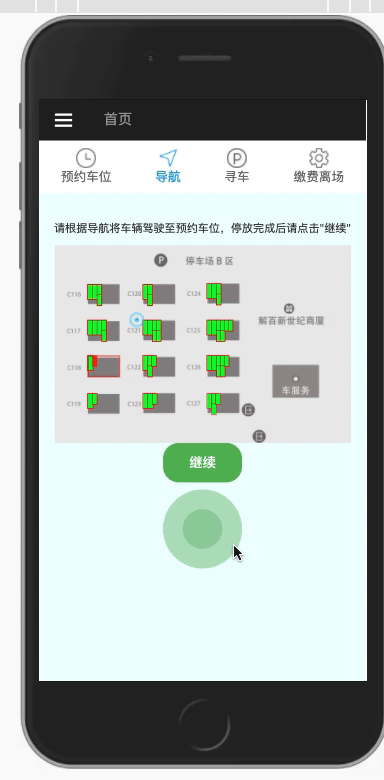

# parking_app
项目演示：



针对这个圆点边扩散变移动的实现方法，采用了如下方式：

首先按照[https://segmentfault.com/a/1190000008560571](https://github.com/fjh1997/parking_app)这个文章作者的方法绘制一个动态扩散的圆点，并命名为canvas，注意这个canvas是临时的，并不渲染在html页面上。
```javascript
var canvas =  document.createElement('canvas');

var context = canvas.getContext("2d");
canvas.width=20;
canvas.height=20;
var width = canvas.width, height =width;
........
........
```
然后真正在需要渲染的gamecanvas上面每隔一段时间在不同位置坐标绘制上述这个临时canvas，这样就做出了边移动边扩散的效果，就比较自然。
```javascript
var gamecanvas = document.getElementById("gameCanvas");

var render = function () {
    //将canvas的图像绘制到gamecanvas中
    gamecontext.clearRect(0, 0, gamecanvas.width, gamecanvas.height);
    car_x += pressure_x;
    car_y += pressure_y;
    gamecontext.drawImage(canvas, car_x, car_y, 20, 20);
};

```

项目地址：[https://github.com/fjh1997/parking_app](https://github.com/fjh1997/parking_app)
参考：[https://segmentfault.com/a/1190000008560571](https://github.com/fjh1997/parking_app)